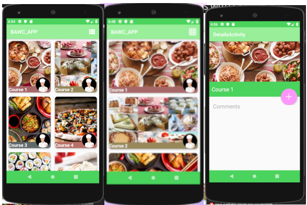

# BUILD APPS WITH CAITLYN

Android app to show Caitlyn's courses.
I used these technologies:

* Java
* [Picasso](https://square.github.io/picasso/)
* [Palette](https://developer.android.com/training/material/palette-colors)
* [RecyclerView](https://developer.android.com/reference/android/support/v7/widget/RecyclerView)

## USAGE

install apk in android phone version 6 or higher 

## ENVIRONMENT

* Android 6.1
* gradle 4
* Android SDK 28

